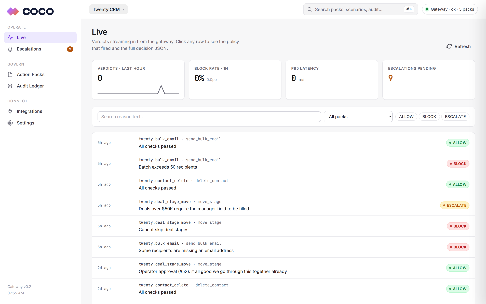
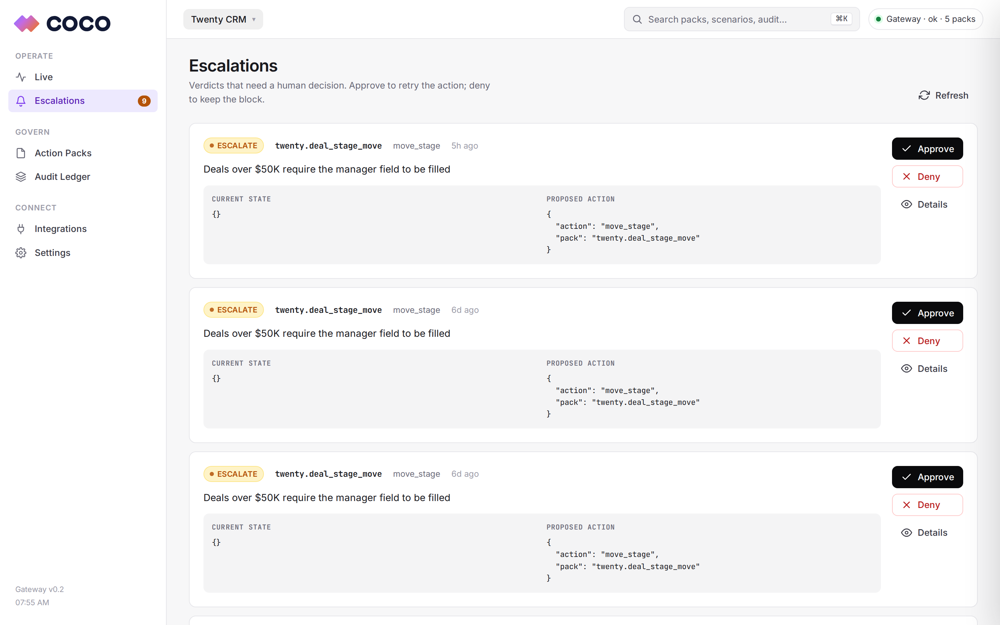
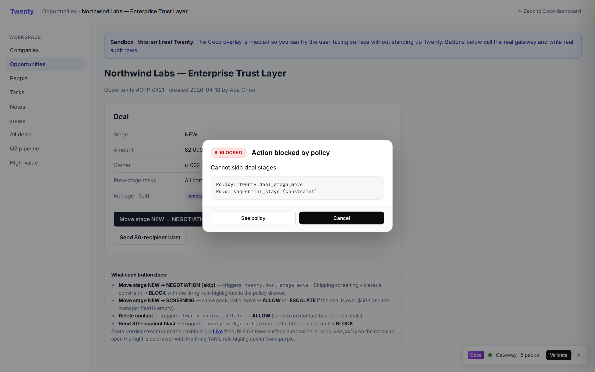
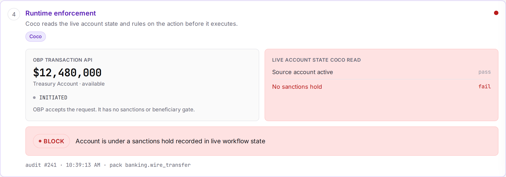
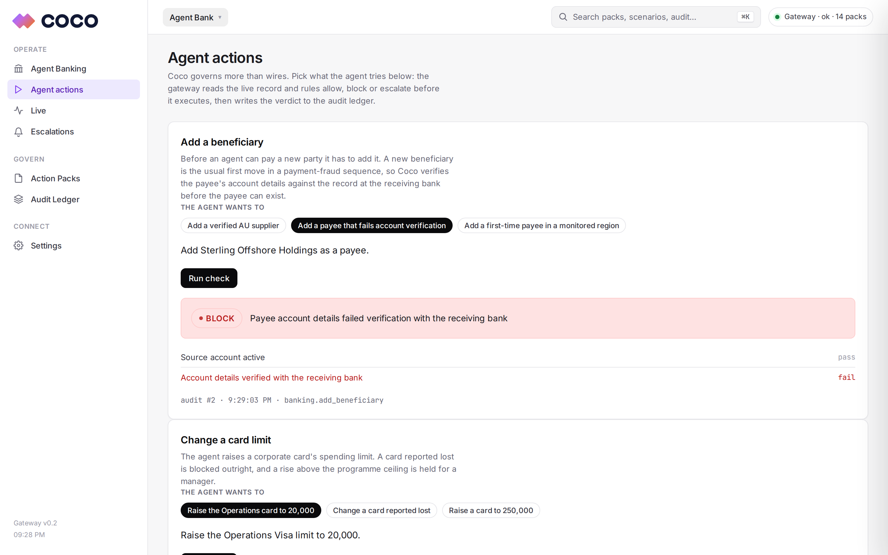

# Coco Trust Layer

Runtime governance for AI agents acting on enterprise SaaS. The agent asks before it acts. Coco checks the request against a YAML policy, returns **ALLOW**, **BLOCK** or **ESCALATE**, and writes the verdict to an audit log.




One gateway serves three workspaces: Twenty CRM governance, agent banking and securities lending. The toggle top-left switches between them.

## What it does

Three building blocks:

1. **Action Packs.** Plain YAML that describes what an action must look like to be valid. The team that owns the rules writes them, not engineering.
2. **Gateway.** A FastAPI service. It takes the agent's intent, reads live state from the system of record, evaluates the pack, and returns a verdict.
3. **Audit ledger.** SQLite. Every verdict, every reason, every policy version that fired.

| Verdict | Effect |
|---|---|
| `ALLOW` | Action proceeds. Mutation lands. Row written. |
| `BLOCK` | Action stopped. Reason logged. |
| `ESCALATE` | Action paused. A human reviews it in the dashboard. |

## Why

Copilots now write to CRMs, banks and finance tools faster than human RBAC was built for. Vendor permissions cover users, not agents that take twenty actions a minute. When an agent does the wrong thing, the blast radius is large and the trail is thin.

Hard-coded guards do not scale. Each tenant has different stages, limits and review thresholds, and the people who know the rules cannot edit Python. YAML packs let them write the policy; Coco enforces it and logs every call.

## Quickstart

```bash
git clone git@github.com:khoapham154/coco-trust-layer.git
cd coco-trust-layer

conda create -n coco python=3.11 -y
conda activate coco
pip install -r backend/requirements.txt

tmux new-session -d -s coco_gateway -c $PWD
tmux send-keys -t coco_gateway \
  'COCO_ALLOW_DEMO_RESET=1 PYTHONPATH=$PWD uvicorn main:app \
     --app-dir backend --host 0.0.0.0 --port 8080' Enter

curl -s localhost:8080/health
# {"status":"ok","packs_loaded":9}

open http://localhost:8080/dashboard
```

The dashboard needs no external service. Open `/sandbox/twenty` to try the user-facing overlay.

## The dashboard

The toggle top-left switches workspace. Each shows only its own packs, verdicts and escalations.

- **Live.** Verdicts stream in. Tiles for throughput, block rate, p95 latency and escalations pending. Click a row for the full decision and the YAML rule that fired.
- **Action Packs.** Edit a pack as YAML, save, and the gateway hot-reloads. Prior versions snapshot to disk for revert.
- **Escalations.** Verdicts that need a human. Approve to retry, deny to keep the block. Both write follow-up rows.
- **Audit Ledger.** Filter by pack, verdict, date and reason. Export to CSV with each decision's JSON.



Inside Twenty, a Shadow-DOM overlay shows a corner badge and, on a blocked action, a modal that names the policy, the failing rule and the reason.



## Connect a real Twenty

The dashboard works standalone. To drive a live Twenty instance you need Docker. Run `bash scripts/setup_twenty.sh`, create an API key in Settings → Developers, seed it with `python scripts/seed_twenty.py`, then paste the key into Integrations. Full steps in [docs/twenty_integration.md](docs/twenty_integration.md) and [the walkthrough](docs/demo_walkthrough.md).

## Agent banking

Coco governs an AI agent that operates a bank account. It reads the live account state at the moment of each action and returns ALLOW, BLOCK or ESCALATE before the action commits. The interface is the Open Bank Project v5.1.0 API, the open standard banks expose.

A wire passes through the layers of the agent-banking trust stack: discovery, identity, authorisation, runtime enforcement, detection, investigation. The other layers check who the agent is and what it may do. Coco checks what is actually true in the account, in the moment, before the money moves.



An agent wires $2M and the payment API accepts it, because the request is well-formed and the account is funded. A sanctions hold sits in the account state the payment API never returns. Coco reads that state, fails the check, and blocks the transfer before it reaches SWIFT, with the rule and the reason in the audit row. A $250k transfer with no hold but above the auto-approve limit escalates to a human instead.

Coco governs the rest of what the agent does to the bank on the same engine.



| Case | The agent | Coco |
|---|---|---|
| Wire transfer | Sends $2M to a counterparty under a sanctions hold | **BLOCK** before SWIFT |
| Add beneficiary | Adds a payee in a sanctioned jurisdiction | **BLOCK** before any payment |
| Card limit | Raises a corporate card limit past the ceiling | **ESCALATE** to a manager |
| Data export | Pulls customer records with no stated purpose | **BLOCK** the export |

The walkthrough is in [the banking script](docs/banking_demo_script.md); the design is in [docs/architecture.md](docs/architecture.md).

## Securities lending

Coco governs an AI agent booking securities loans on a lending desk. The booking system accepts every well-formed request; Coco reads the live desk blotter at the moment of each action and returns ALLOW, BLOCK or ESCALATE before the loan commits. Each contract is anchored to a [FINOS Common Domain Model](https://cdm.finos.org/) event, the open standard ISLA, ISDA and ICMA built for securities finance.

The hero pipeline shows one booking moving through its lifecycle. Locate and Rate clear, the booking API accepts the request, and then Coco reads the live state: inventory, the borrower's running exposure, the recall flag. The contrast is the story. Without Coco the loan commits and the breach surfaces next morning in reconciliation. With Coco it never books, the rule that fired is named, and the decision is in the audit log.

| Pack | CDM event | The agent | Coco |
|---|---|---|---|
| `securities_lending.loan_execution` | NewTrade | Books a loan that breaches the borrower's exposure cap | **BLOCK** before it commits |
| `securities_lending.collateral` | CollateralUpdate | Posts collateral below the margin threshold | **BLOCK** the posting |
| `securities_lending.rate` | Execution | Underprices a hard-to-borrow name below its floor | **BLOCK** the fee |
| `securities_lending.recall` | Recall | Rolls a loan that is already under recall | **BLOCK** the roll |
| `securities_lending.reporting` | Allocation | Files an SFTR report past the T+1 deadline | **ESCALATE** to a supervisor |

The desk blotter is a fixture standing in for a lending platform such as an extended [FINOS TraderX](https://github.com/finos/traderX); the bridge to a real desk is a design partner with a live workflow. The walkthrough is in [the securities-lending script](docs/seclend_demo_script.md).

## Action Packs

Twenty CRM:

| Pack | Action | Governs |
|---|---|---|
| `twenty.deal_stage_move` | `move_stage` | Pipeline transitions, high-value review |
| `twenty.contact_delete` | `delete_contact` | Contact lifecycle, role enforcement |
| `twenty.opportunity_create` | `create_opportunity` | Deal creation, data integrity |
| `twenty.bulk_email` | `send_bulk_email` | Outreach limits, do-not-contact |
| `twenty.field_update` | `update_field` | Required fields, archived records |

The four banking packs (`banking.wire_transfer`, `banking.add_beneficiary`, `banking.card_controls`, `banking.data_export`) and the five securities-lending packs (`securities_lending.*`) govern the cases above. Packs live in `data/twenty/packs/`, `data/banking/packs/` and `data/securities_lending/packs/`. Each is about 30 lines of YAML. The DSL is an AST-safe subset of Python: comparisons, booleans and dotted reads, with no calls, dunders or imports. See [`backend/engine/dsl.py`](backend/engine/dsl.py).

## Testing

```bash
PYTHONPATH=$PWD pytest tests/ -v                        # 51 unit tests
PYTHONPATH=$PWD python tests/run_twenty_scenarios.py    # 19/19 regression
bash scripts/banking_smoke.sh                           # banking backend, every verdict
bash scripts/seclend_smoke.sh                           # securities-lending backend, every verdict
bash scripts/journeys_smoke.sh                          # 6 product journeys
```

## Repo

```
coco-trust-layer/
├── backend/
│   ├── engine/             pydantic models, AST-safe DSL
│   ├── routes/             validate, packs, packs_yaml, audit, audit_advanced, scenarios,
│   │                       metrics, escalations, twenty_ops, demo, demo_bank, demo_seclend, mock_obp, dashboard
│   ├── providers/          twenty.py (CRM state) + bank.py (OBP state) + seclend.py (desk blotter)
│   ├── dashboard/          templates/index.html + static/{app.js, styles.css, tokens.css}
│   └── db/audit_log.py     SQLite ledger + escalation_status
├── agents/                 Python agent (Twenty REST via the gateway)
├── frontend/               coco-sdk.js + inject.js (Shadow-DOM overlay)
├── browser-extension/      Chromium MV3 content scripts
├── data/
│   ├── twenty/packs/       5 CRM packs + auto-snapshotted _versions/
│   ├── twenty/scenarios/   19 JSON scenario fixtures
│   ├── banking/            4 banking packs + OBP fixtures (accounts, resources)
│   └── securities_lending/ 5 CDM-anchored packs + blotter fixtures (securities, counterparties, loans, reports)
├── tests/                  pytest + scenario regression
├── scripts/                setup_twenty.sh, seed_twenty.py, seed_banking.py,
│                           banking_smoke.sh, journeys_smoke.sh, snapshot.py
├── docs/                   architecture, how_to_run, twenty_integration,
│                           demo_walkthrough, banking_demo_script, images/
└── README.md
```

## License

MIT. See [LICENSE](LICENSE).

Copyright © 2026 Team Coco.
