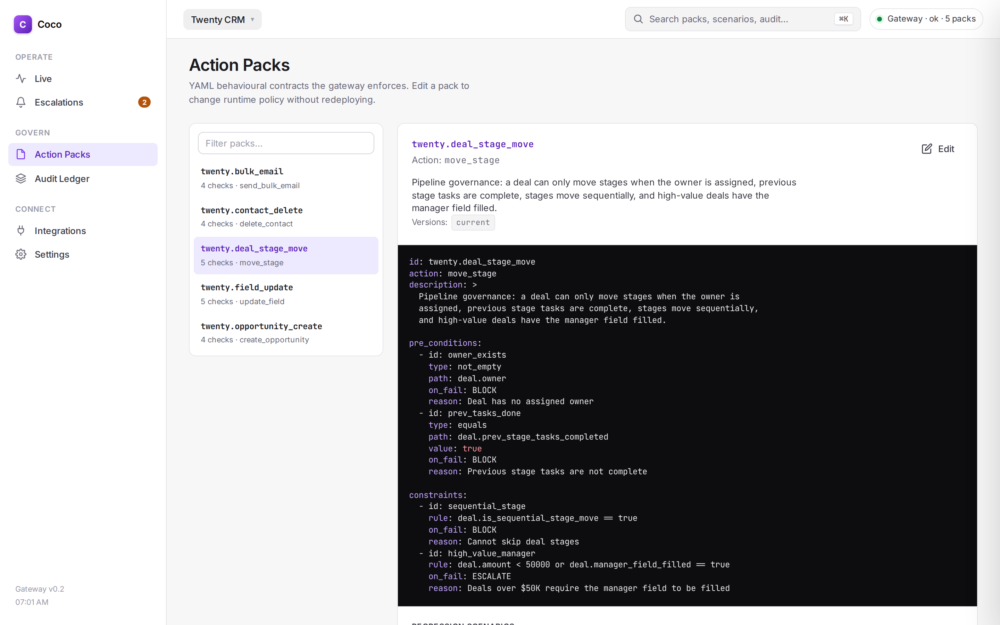
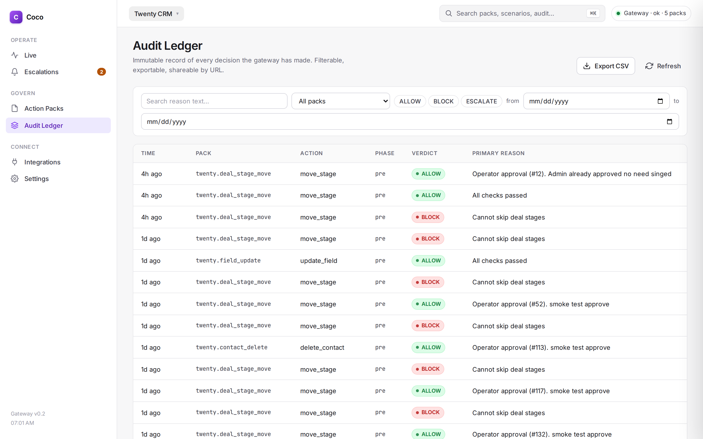
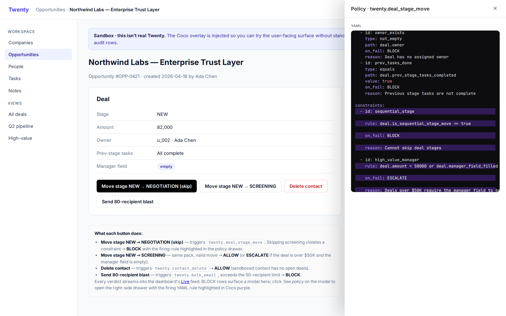

# Coco Trust Layer

Runtime governance for AI agents acting on enterprise SaaS. The agent
asks before it acts. Coco checks the request against a YAML policy,
returns **ALLOW**, **BLOCK** or **ESCALATE**, and writes the verdict to
an audit log.


## What it does

Three building blocks:

1. **Action Packs.** Plain YAML files that describe what an action must
   look like to be valid. RevOps writes them, not engineering.
2. **Gateway.** A FastAPI service. Receives the agent's intent, reads
   live state from the SaaS, evaluates the pack, returns a verdict.
3. **Audit ledger.** SQLite. Every verdict, every reason, every
   policy version that fired.

Three verdicts:

| Verdict    | Effect                                           |
|------------|--------------------------------------------------|
| `ALLOW`    | Action proceeds. Mutation lands. Row written.    |
| `BLOCK`    | Action skipped. Reason logged.                   |
| `ESCALATE` | Action paused. Human reviews it in the dashboard.|

## Why

Modern copilots write to CRMs, EHRs and finance tools at a pace human
RBAC was never designed for. Vendor permissions cover users, not agents
that do twenty things a minute. When an agent does the wrong thing, the
blast radius is large and the trail is thin.

Hard-coded guards do not scale. Each tenant has different stages,
different retention rules, different review thresholds. The people who
know the rules cannot edit Python. YAML packs let them write the policy
and Coco enforces it.

## Quickstart

```bash
git clone git@github.com:khoapham154/coco-trust-layer.git
cd coco-trust-layer

conda create -n coco python=3.11 -y
conda activate coco
pip install -r backend/requirements.txt

tmux new-session -d -s coco_gateway -c $PWD
tmux send-keys -t coco_gateway \
  'COCO_ALLOW_DEMO_RESET=1 PYTHONPATH=$PWD uvicorn main:app \
     --app-dir backend --host 0.0.0.0 --port 8080' Enter

curl -s localhost:8080/health
# {"status":"ok","packs_loaded":5}

open http://localhost:8080/dashboard
```

No Twenty needed for the dashboard. Open the built-in sandbox at
`http://localhost:8080/sandbox/twenty` to try the user-facing overlay.

## What you see

### Live

Verdicts stream in from the gateway. Tiles for throughput, block rate,
p95 latency, escalations pending. Click any row to see the full
decision JSON and the YAML rule that fired.


### Action Packs

The five Twenty packs as editable YAML. Edit, save, and the gateway
hot-reloads the engine. Previous versions snapshot to disk so you can
revert.



### Escalations

Verdicts that need a human. Approve to retry the action, deny to keep
the block. Both decisions write follow-up audit rows.


### Audit Ledger

Full table. Filter by pack, verdict, date and reason text. Export to
CSV with every decision's JSON.



### Twenty overlay (user-facing)

Inside Twenty, a small badge sits in the corner. When an agent (or a
user) attempts a blocked action, Coco interrupts with a modal that
names the policy, the failing rule and the plain-English reason. The
"See policy" button opens the YAML with the firing rule highlighted.




The overlay runs inside a Shadow DOM so Twenty's CSS cannot break it.
To try it without setting up Twenty, open the built-in sandbox at
`/sandbox/twenty`.

## End to end with real Twenty

You need Docker. About 2 GB of disk for the Postgres + images.

```bash
bash scripts/setup_twenty.sh        # ~5 min first run
# open http://localhost:3000, create account, Settings → Developers → API key
export TWENTY_API_KEY=eyJ...
python scripts/seed_twenty.py       # 5 companies, 10 people, 3 deals
```

Back in the dashboard, go to Integrations, paste the API key, test the
connection. Drag the bookmarklet to your bookmarks bar. Click it on a
Twenty tab. The Coco badge appears.

For the full sequence, see [docs/demo_walkthrough.md](docs/demo_walkthrough.md).

## Action Packs

| Pack                        | Action               | Governs                              |
|-----------------------------|----------------------|--------------------------------------|
| `twenty.deal_stage_move`    | `move_stage`         | Pipeline transitions, high-value review |
| `twenty.contact_delete`     | `delete_contact`     | Contact lifecycle, role enforcement |
| `twenty.opportunity_create` | `create_opportunity` | Deal creation, data integrity |
| `twenty.bulk_email`         | `send_bulk_email`    | Outreach limits, do-not-contact     |
| `twenty.field_update`       | `update_field`       | Required fields, archived records   |

Packs live in `data/twenty/packs/`. Each is ~30 lines of YAML. The DSL
is an AST-safe subset of Python: comparisons, booleans, dotted reads.
No calls, no dunders, no imports. See
[`backend/engine/dsl.py`](backend/engine/dsl.py).

## Testing

```bash
PYTHONPATH=$PWD pytest tests/ -v                        # 45 unit tests
PYTHONPATH=$PWD python tests/run_twenty_scenarios.py    # 19/19 regression
bash scripts/journeys_smoke.sh                          # 6 product journeys
```

`journeys_smoke.sh` walks the six product journeys (install,
Live + metrics, escalations, policy edit, validate, audit + CSV) against
a running gateway. Useful as a deploy gate.

## Repo

```
coco-trust-layer/
├── backend/
│   ├── engine/             pydantic models, AST-safe DSL
│   ├── routes/             validate, packs, packs_yaml, audit, audit_advanced,
│   │                       scenarios, metrics, escalations, twenty_ops, demo, dashboard
│   ├── providers/twenty.py live Twenty REST → ui_state projection
│   ├── dashboard/          templates/index.html + static/{app.js, styles.css, tokens.css}
│   └── db/audit_log.py     SQLite ledger + escalation_status
├── agents/                 Python agent (Twenty REST via the gateway)
├── frontend/               coco-sdk.js + inject.js (Shadow-DOM overlay)
├── browser-extension/      Chromium MV3 (MAIN-world content scripts)
├── data/twenty/
│   ├── packs/              5 YAML packs + auto-snapshotted _versions/
│   └── scenarios/          19 JSON scenario fixtures
├── tests/                  pytest + scenario regression
├── scripts/                setup_twenty.sh, seed_twenty.py,
│                           journeys_smoke.sh, snapshot.py, test_overlay.py
├── deploy/                 docker-compose for local dev
├── docs/                   architecture, how_to_run, twenty_integration,
│                           demo_walkthrough, images/
└── README.md
```

## License

MIT. See [LICENSE](LICENSE).

Copyright © 2026 Khoa Pham.
